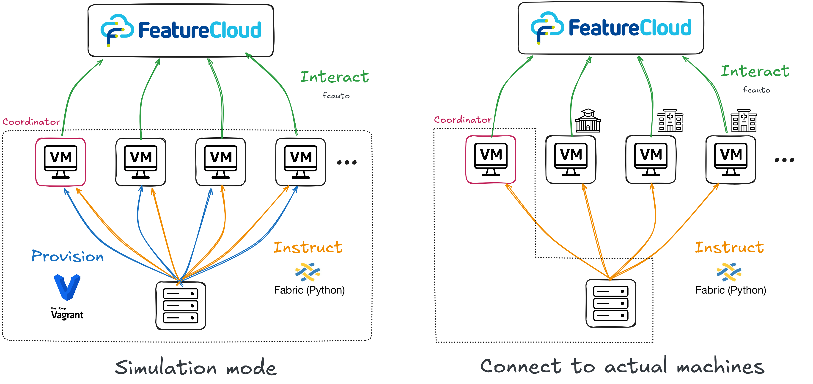
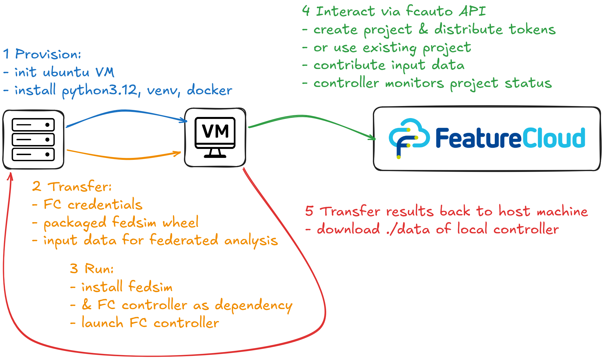

# FedSim

The aim of this project is to automate federated analyses of FeatureCloud.ai either as simulations or to orchestrate real machines.

The main components are: 

- setup and provisioning of VMs using vagrant
- instructions are sent to clients via the python module fabric
- a reverse engineered featurecloud API that allows for headless interaction with featurecloud.ai


What this project does not automate:

- user creation at featurecloud.ai
- user's site registration at featurecloud.ai
- featurecloud apps that require frontend interaction of the coordinator


## Concept

Fedsim is essentially an infrastructure wrapper to use featurecloud.ai without manual interaction. 
It's design is intended to allow the use of local simulated VMs (on the same hardware), or connection to machines at other participating institutes. 
The second use case could for example be in the context of a collaboration where data remains at participating institutes but access to a VM with that data is granted to the controller of the analysis.





The steps executed for each VM can be seen here:




## Requirements & installation

- For simulations vagrant and some virtualisation provider are required. For development I'm using libvirt and the vagrant-libvirt plugin.

  - Instructions to install vagrant: https://developer.hashicorp.com/vagrant/install

  - Instructions for the vagrant-libvirt plugin: https://vagrant-libvirt.github.io/vagrant-libvirt/installation.html#ubuntu--debian

- To build the fedsim package `hatch` is required. E.g.:

  `pipx install hatch`


- Clone the project and install it.

  ```
  git clone https://github.com/W-L/FedSim.git && cd FedSim/
  pip install .
  ```


## Usage

There are 2 main executables in this project: 

1) a program to interact with FeatureCloud.ai headlessly. This is called `fcauto`. 
2) a program to run simulations/real analyses headlessly. This is called `fedsim` and uses the first component internally.


### fcauto

This is based on a reverse-engineered API for the FeatureCloud.ai website. 
There are several subcommands to interact with FeatureCloud projects.
Check `fcauto SUBCOMMAND --help` for arguments/options.


```
usage: fcauto [-h] {create,join,monitor,query,contribute,reset,list-apps} ...

FeatureCloud automation tool

positional arguments:
  {create,join,monitor,query,contribute,reset,list-apps}
    create              Create a new FeatureCloud project (as coordinator)
    join                Join an existing FeatureCloud project
    monitor             Monitor a running FeatureCloud project
    query               Query FeatureCloud project status
    contribute          Contribute data to a FeatureCloud project
    reset               Reset a FeatureCloud project to status 'ready'
    list-apps           List available apps on FeatureCloud

options:
  -h, --help            show this help message and exit
```


### fedsim

This program orchestrates the participants/client machines and instructs them to interact with the FeatureCloud.ai website.

```
usage: fedsim [-h] -c CONFIG [-v]

Simulated federated analyses with VMs

options:
  -h, --help            show this help message and exit
  -c CONFIG, --config CONFIG
                        Path to the config file
```


## Configuration

Configuration of this project requires 2 files. 
An environment file that contains all credentials of the featurecloud.ai users.
This needs to be in the format USER=PASSWORD and be placed in `.env` in the root of the project.


The second file is a toml configuration of simulations/real runs of featurecloud. The format is as follows:


```
[general]

sim = true                              # whether vagrant VMs or real machine are used
project_id = PROJECT_ID                 # numeric ID of a featurecloud project (in it's URL)
tool = TOOL_NAME                        # alternatively to a project_id, then a project is created automatically


[clients]                               # a list of the participating clients

[clients.0]
fc_username = USERNAME
data = ["path/to/file1", "path/to/file2"]
coordinator = true
hostname = ''                           # these fields can be left empty when using vagrant
username = ''                           # if real machines are used, their details go here
port = '' 
sshkey = '' 


[clients.1]
fc_username = USERNAME
data = ["path/to/file1", "path/to/file2"]
hostname = ''
username = ''
port = '' 
sshkey = '' 

...


```


If `sim = true` is set, `hostname, username, port, sshkey` are ignored and vagrant vms are used instead. When real machines should be used, their connection details need to be provided.
The field sshkey is the path to the ssh key used to authenticate the user on the remote. Exchange of connection credentials is only automated in the simulation with vagrant.


## Example usage


A config is provided to run the 'mean' test app across 3 clients (with the same sample data provided in the repo of the app). Featurecloud users need to be provided in the config.

`fedsim -c configs/config_mean_trio.toml`


## Provisioning of client VMs/participating machines

System dependencies on remotes are installed automatically using a shell script shipped in `fedsim/provision.py`.
 
- python and a venv to run the programs
- docker (used by featurecloud)


## Terms of accceptable use and responsible automation

This library provides programmatic access to functionality of featurecloud.ai that is normally available through manual interaction with the website. It does not bypass authentication mechanisms or access controls.
To promote responsible use, the library enforces request limits and identifies itself explicitly via a User-Agent header at each request. These measures are intended to reduce the risk of excessive load or unintended disruption to the website.
Users are responsible for ensuring that their use of this library complies with the website’s Terms of Service and applicable policies. High-volume scraping, aggressive polling, or other usage patterns that exceed normal interactive behavior are out of scope and may result in blocking by the website operator.
If the website signals rate limiting or access restrictions (e.g. HTTP 429 or 403 responses), users need to reduce their request frequency or stop usage. The author does not operate or control the target website and makes no guarantees regarding access or compatibility.


## pytests


Run the pytest suite with `pytest -s --cov` or `pytest -s --cov -m 'not integration'` to skip slow tests. 
There are not many tests not marked as integration though, since most of the code in this project interacts with VMs.
Some tests require featurecloud credentials in the environment, which are not provided in this repo.


## TODO

2 operations on the VMs are currently using elevated permisions
- is this because featurecloud/docker writes output as root?

write some convenience scripts that check the log files of all machines
- including the logs of the fc controllers and the fc apps

in the provisioning script, the docker version is currently fixed due to FC restrictions

increase pytest coverage of API


