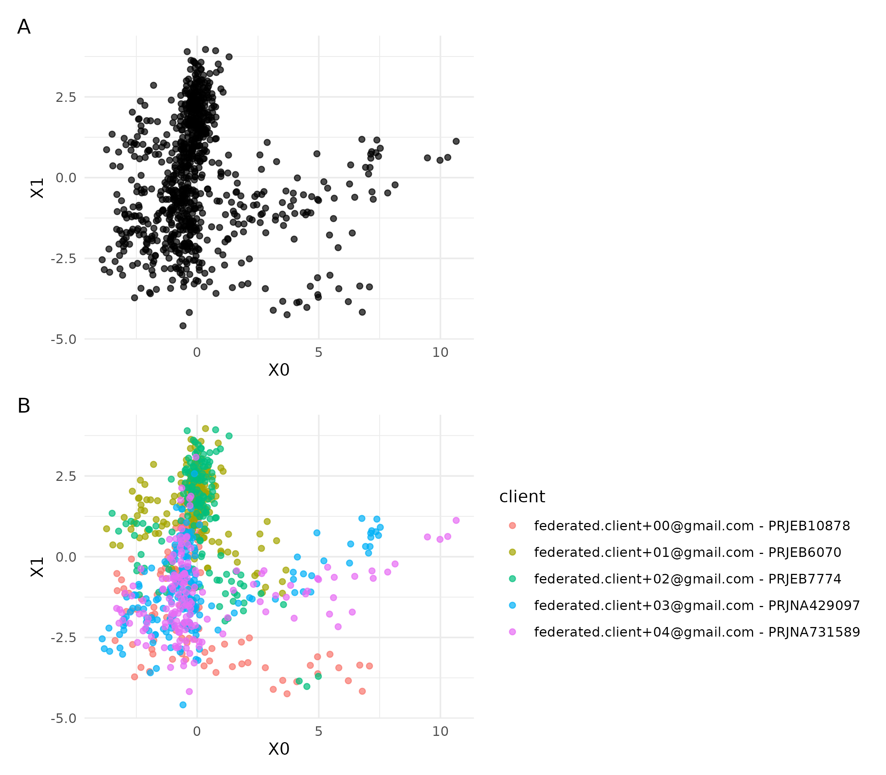
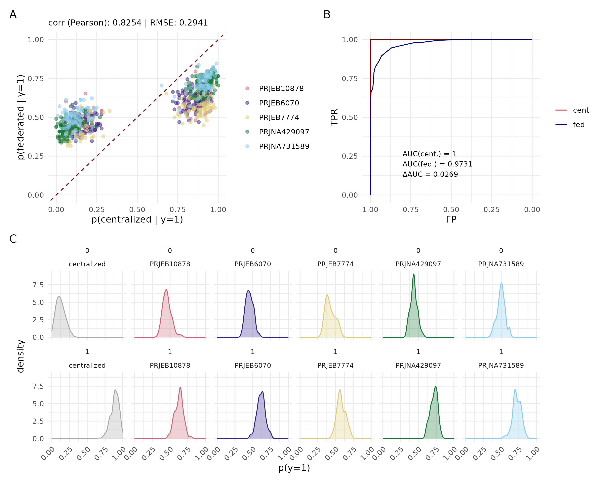

# fedsim_comp

This repository contains a reproducible snakemake workflow that compares the execution of centralised and federated analyses. For running the federated tools featurecloud.ai is used via fedsim (custom VM & API automation tool for featurecloud). Both kinds of analyses are run through fedsim; the centralised analysis with a single client that possesses all data and the federated analyses with several clients that only have access to a portion of the data. The client-local results are combined in this workflow after the federated steps.

At the moment the workflow compares these federated tools:

- federated-svd

## Setup & configuration

The workflow depends on a conda environment which can be installed with:

`conda env create -f env.yaml -n comp && conda activate comp`

The workflow also needs fedsim to be installed. 
Since it is not on pypi yet, it needs to be pulled from the repo and then installed via pip. 
Once it is on pypi I'll add it to the conda dependencies.

`cd workflow && git clone https://github.com/W-L/FedSim.git`
`cd FedSim && hatch build && pip install .`

all configurable parameters of the workflow are in 

`workflow/config/config.yaml`

## Run workflow

`conda activate comp`

`snakemake --resources serial=1 --sdm conda -p -cN`

`--resources serial=1` makes sure that multiple runs of fedsim are performed in series to avoid that individual fedsim runs use the same VMs concurrently.

## Steps

`snakemake --rulegraph | dot -Tpng > figs/rulegraph.png`

- prep_data
    - download public cohort data
    - filter to project accessions (listed in workflow config.yaml)
    - write data files for each federated client

- fedsim_svd
    - runs twice (forced serially), once with a single client and all data, and once with 5 clients and separated data
    - config files for the fedsim runs are in resources/

- unzip_fedsim
    - extract the SVD/PCA results for all clients in both runs

- combine_federated_results
    - concatenate the federated pca output data 
    - adds a column to identify the client and project accession for visualisation

- visualise_projections
    - this is run manually 
    - creates figure to compare centralised and federated SVD

## Details on SVD output files

These are my interpretations of the output files:

- eigenvalues.tsv: Eigenvalues of the global covariance matrix. Each value corresponds to a principal component (PC) and measures variance captured. These are global?
- variance_explained.csv: Eigenvalues normalized to fractions of total variance. These are global?
- right_eigenvectors.tsv: Loadings (principal axes). Columns are PCs; rows are features. These define the shared global PCA space.
- left_eigenvectors.tsv: Scores of samples in PC space up to scaling.
- projections / localData.csv: Per-client projections of samples onto the global PCs.
- scaled_data.tsv: Globally centered and scaled data used for PCA.

## Note about input format issue

There's an issue with the input format for "federated-svd": The instructions say that rows should be samples, and columns should be features. However, it only works when the input is transposed:

https://github.com/AnneHartebrodt/fc-federated-svd/issues/2

## Results

Embedding of downsampled species signal features for a centralised analysis (A), and a federated run with 5 clients (B). The embeddings are identical for both executions. The input features were randomly downsampled to 5%, i.e. ~130 columns, to save on execution time.

 

---

 

Results of random forest classification for a centralised versus federated analysis. 
The input data was downsampled to 5% of the total features, and the training and test data are equivalent. 
So these results have no meaning except for comparison of the analyses.
(A) Scatter plot of probabilities for class 1 for the centralised (x-axis) and federated analyses (y-axis).
(B) ROC curves and deltaAUC of the global versus local classifiers.
(C) Densities of probalities for class 1 separated by true class label (vertical) and by classifier (horizontal)

## Todo

check what other federated tools we want to compare

follow up on the github issue
- there's a system to check code security of featurecloud apps
- but is there also a system to check code functionality/correctness?
- for the svd app there is some testing code, but with hard-coded paths to scripts that are not part of the repo

