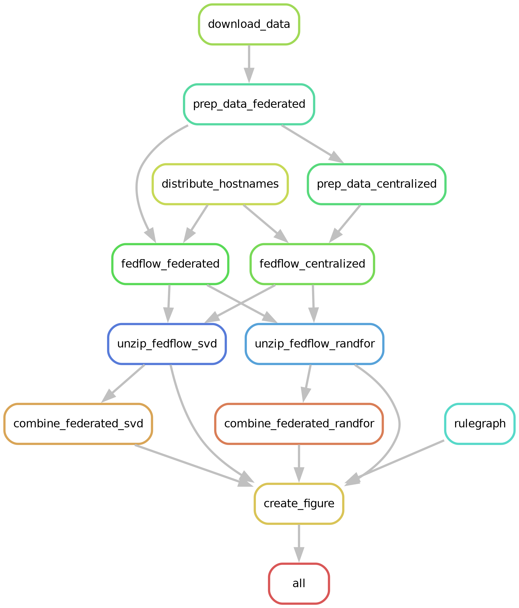
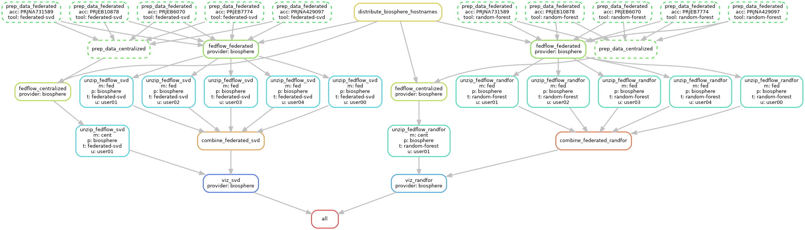
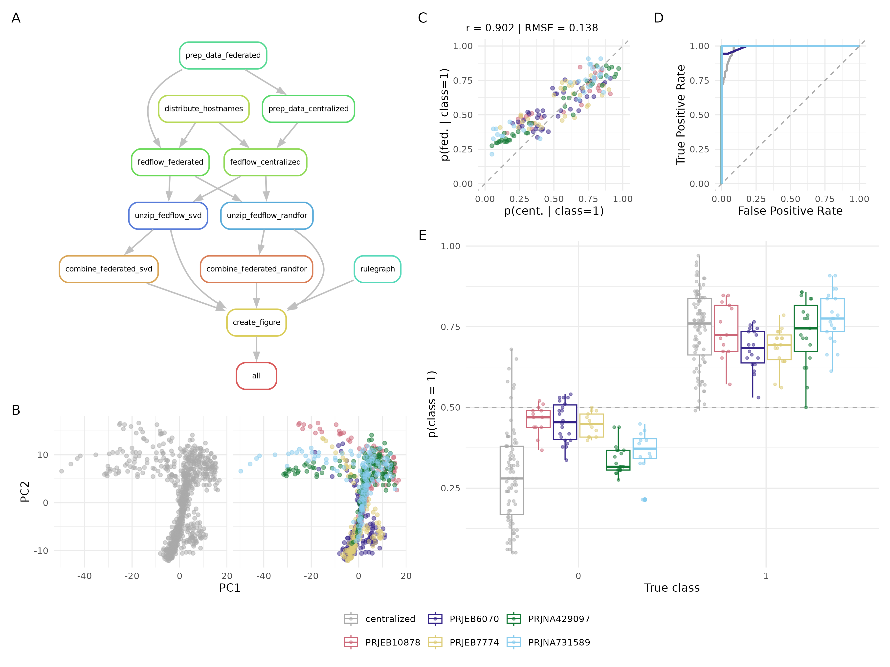

# fedflow_comp

This repository contains a reproducible snakemake workflow that compares the execution of centralised and federated analyses. For running the federated tools FeatureCloud.ai is used via fedflow; the centralised analysis with a single client that possesses all data and the federated analyses with several clients that only have access to a portion of the data. The client-local results are combined in this workflow after the federated computation.

At the moment the workflow compares these federated tools:

- federated-svd
- random-forest
- ada-boost

## Setup & configuration

The workflow depends on a conda environment which can be installed with:

`conda env create -f env.yaml -n comp && conda activate comp`

The workflow also needs fedflow to be installed. 

`pip install fedflow-featurecloud`

all configurable parameters of the workflow are in 

`workflow/config/config.yaml`

## Run workflow

`conda activate comp`

`snakemake --resources serial=1 -p -cN`

`--resources serial=1` makes sure that multiple runs of fedsim are performed in series to avoid that individual fedsim runs use the same VMs concurrently.

## Steps

`snakemake --rulegraph | dot -Tpng > rulegraph.png && snakemake --dag | dot -Tpng > jobgraph.png`

<!--  -->
<!--  -->

## Results

The product of this workflow shows its rulegraph (A) as well as an embedding of metagenomic and clinical features for a centralised analysis and a federated run with 5 clients (B). The embeddings are identical for both executions. 
Further, a random forest classification for a centralised versus federated analysis is performed. 
Input data contains metagenomic species counts and clinical data and was split into training and testing data (80:20).
A scatter plot of probabilities for class 1 for the centralised (x-axis) and federated analyses (y-axis) shows good correspondance between these analysis modalities (C). Good performance is confirmed by ROC curves of the global and local classifiers (D). (E) The distributions of probalities for class 1 separated by true class label shows that while there is adequate separation, careful calibration of model predictions is required.

### Todo for adding new tools to the workflow

- add config files in configs/ (tool and fedflow configs)
- add tool name in workflow config.yaml
- add input data (adjust or add preparation script)
- verify that generic fedflow snakemake rule is appropriate
- add script to combine federated results
- add script to visualise results

